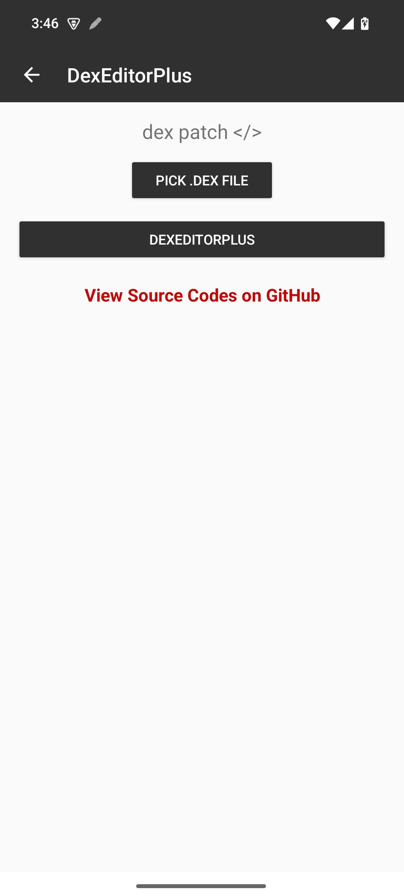
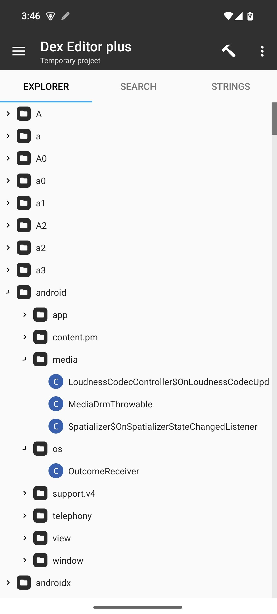

# LibGrabber

Dex Editor Plus ( BETA ) is an Android tool designed to edit dex file easily...!

## How It Works

logic from the following open-source repositories:

- [JesusFreke](https://github.com/JesusFreke/smali)
- [FastScroller](https://github.com/developer-krushna/FastScroller)
---

## Overview

 Dex Editor Plus is a powerful Android application designed to parse Opcode, analyze, and analize class tables from dex class object 


|  | [LibGrabber](https://github.com/ispointer/DexEditorPlus) |
|-------------------------------------------------------------------------------------------------------------------------------|---------------------------------------------------|

## Screenshots
| App UI                                                                 | Tree                                                                    |
| ---------------------------------------------------------------------------- | --------------------------------------------------------------------------- |
|  |  |

## License

- [Apache-2.0](https://www.apache.org/licenses/LICENSE-2.0)

```
License

Licensed under the Apache License Version 2.0.

Copyright © 2026 HighCapable

Dex Editor Plus aims to provide a fast, modern, and developer-friendly environment for exploring and understanding Android DEX files directly on Android devices
```

Copyright © 2026 HighCapable
